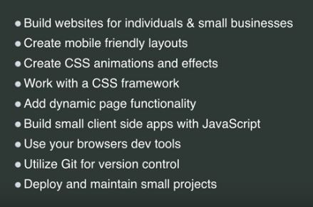

# Web Development Guide 2020

Guide from Brad Traversy's YT channel. [Watch Full Video.](https://www.youtube.com/watch?v=0pThnRneDjw&t=929s)

## Tool Related YT Videos

1. 15 VSCode Extensions. [Click Here](#)
2. VSCode intro and setup. [Click Here](#)

## The Building Block

* HTML5
* CSS Fundamentals - colors, fonts, positioning, **box model**
* CSS Grid and Flex Box
* CSS Custom Properties
* CSS Transition

### Suggested YT Videos

* [HTML Crash Course For Beginners]()
* [CSS Crash Course For Beginners]()
* [CSS Grid Crash Course]()
* [Flexbox in 20 Minutes]()

## Responsive Design

* Vieweport
* Media Queries
* Fluid Widths
* rem units over px
* Mobile First 

### Suggested YT Videos

* [Build an HTML5 Website with a responsive Layout]()
* [Responsive Landing Page]()
* [Build a responsive Mobile first Website]()
* [Build a netflix Clone]()

## Custom Reusable Components

Use of SaSS

### Suggested YT Videos

* [Social Network Theme with sass]()
* [Responsive Portfolio Project]()
* [Fancy From UI]()

## CSS Framework(Choose One)

* Bootstrap
* Tailwind CSS (Trending in 2020)
* Materialize
* Bulma

### Suggested YT Videos

* [Tailwind CSS Crash Course]()
* [Bootstrap CSS Crash Course]()

## Vanilla JavaScript

* Fundamentals variables, data types, functions, conditionals etc
* DOM
* JSON
* Fetch API Request, Response, AJAX
* Modern JS ES6

### Suggested YT Videos

* [JavaScript Crash Course]()
* [DOM Crash Course]()
* [Javascript OOP]()
* [Async Javascript]()
* [Vanilla JS Playlist]()

## Tools 2

* Git and Github
* Browser Dev Tools
* VSCode Extensions
* NPM
* Axios
* Webpack or parcel

### Suggested YT Videos

* [Linux Command Line Basics]()
* [Git Carsh Course]()
* [Axios Crash Course]()
* [Chrome Dev Tools Crash Course]()
* [NPM Crash Course]()

## Basic Deployment

* Domain registration namecheap, google domains etc
* Managed Hosting InMotion, Hostgator, Bluehost etc
* Static Hosting Netlify, Github Pages
* SSL Certificate 

* FTP, SFTP
* SSH
* CLI and Git

### Suggested YT Videos

* [Web Hosting and cPanel Guide]()
* [Deploy Websites in seconds with Netlify]()
* [Github Deploy and Domain]()
* [SSH Crash Course]()  for advanced development

## Basic FE Developer

 

### Suggested YT Videos

* [Frontend, Backend, Fullstack]()
* [10 Things All devs should know]()

## FE Frameworks (Pick Only One)

* React The most popular.
* Vue - Easiest to learn
* Angular 

### Suggested YT Videos

* [React Crash Course]()
* [Vue JS Crash Course]()
* [Angular Crash Course]()

### Suggested Udemy Courses

* [React Front to Back]()
* [Angular Front to Back]()

## State Management

* React Redux, Context API with Hooks
* Vue Vuex

### Suggested YT Videos

* [Redux Crash Course]()
* [Vuex Crash Course]()
* [React Context API]()

## Server Side Rendering

* NEXT React
* NUXT Vue

### Suggested YT Videos

* [Next Crash Course]()
* [Nuxt Crash Course]()

## Server-side Languages(Choose One)

* **Node.js**
* **Python**
* **C#**
* Java
* Rust
* GoLang
* Ruby
* PHP

### Suggested YT Videos

* [Node.js Crash Course]()
* [Python Crash Course]()
* [C# Project in 60 Seconds]()

### Suggested Udemy Courses

* [Node.js API Masterclass]()

## Server-side Framework(Choose One)

* **Node.js Express**
* **Python Django Flask**
* **C# ASP .NET MVC**

### Suggested YT Videos

* [Express Crash Course]()
* [Django Crash Course]()
* [Flask Series]()

### Suggested Udemy Courses

* [Node.js API Masterclass]()
* [Python Django Dev to Deployment]()

## Databases(Choose One)

* **Relational PostgreSQL, MS SQL Server**
* **NoSQL MongoDB**
* **Cloud Databases Firebase**
* Learning SQL, ORM, ODM etc

### Suggested YT Videos

* [MongoDB Crash Course]()
* [Intro to NoSQL]()

